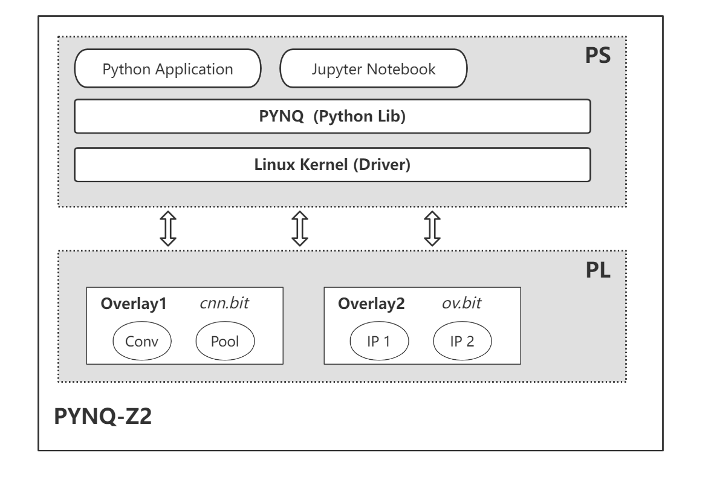

## PYNQ 总体架构

PYNQ 是 Python Productivity for  Zynq 的缩写，即 Zynq 的 Python 生产力，可以认为 PYNQ = Python + ZYNQ，是 Xilinx 推出的一种开放源代码框架，使用 Python 语言和库，使设计人员可以利用 Zynq 中可编程逻辑和微处理器的优势来快速构建高性 能的嵌入式应用程序。通俗来讲，程序员可以通过 PYNQ 这个框架，利用 Pytrhon 语言，方便的加载、访问、使用 FPGA 的硬件电路。

从硬件角度来看，一块 PYNQ 开发板包括了 ARM 处理器部分和 FPGA 部分。其中 ARM 处理器部分运行 Ubuntu 操作系统，被称作 PS 端；FPGA 部分受控于 ARM 处理器，被称作 PL 端。以一块 PYNQ-Z2 开发板为例，PYNQ 的总体架构如下图所示。



### PS 端

PS 端有一个 ARM 处理器，通过 SD 卡的启动方式运行了特制的 PYNQ 系统镜像，在功能上和普通的 Ubuntu 系统没有什么差异。

应用程序以 Python 语言进行开发，通常使用 Jupyter Notebook 来运行。应用程序在代码中调用 PYNQ 的 Python 应用程序编程接口（API）访问 FPGA 硬件，可以进行内存分配、硬件电路的输入输出等操作。

PYNQ 还提供了用于 PS-PL 接口的 Linux 驱动程序，用于控制 PL 端。

### PL 端

PL 端就是 FPGA 端，硬件库指的是具有特定功能的 FPGA 电路，由硬件开发人员设计开发，硬件库也叫做 Overlay，以 .bit 文件格式发布。软件开发人员在 PS 端中通过 Python API 接口加载对应的 .bit 文件，从而加载硬件库并在程序中调用，使用 FPGA 的相应电路。

PL 端可以在应用程序中加载 Overlay 进行调用，实际上具体调用了 Overlay 中叫做 IP 核的单元。一个 IP 核就是一个具有特定功能的硬件电路，例如在运行 CNN 模型的 Overlay 中，有进行卷积计算的 IP 核 Conv 和进行池化计算的 IP 核 Pool。IP 核具有输入输出的地址，应用程序通过在相应的地址写入数据，在相应的地址读取数据，调用这些 IP 核 构建完整的 CNN 模型。

### 运行 Python 应用的过程

下文以 PYNQ 自带的**图片缩放程序**为例，展示 Python 应用程序访问 FPGA 的电路的过程。该应用程序的作用是输入一张图片数据，缩放图片，并输出图片数据。

进行缩放功能的硬件库叫做 resizer，对应的 .bit 文件是 resizer.bit，因此首先 Python 代码先加载这个硬件库。

```python
resize_design = Overlay("resizer.bit")
```

一块 FPGA 在同一时间只能加载一个电路结构，因此加载了一个硬件库后，其它的应用程序不能再加载其他的硬件库，否则会导致电路结构错误。

加载完硬件库后，FPGA 板子上就具有了对应的 Overlay，在这里这个Overlay 有两个 IP 核，其中用于缩放的 IP 核叫做 resize_accel_0，可以通过代码来获取这个 IP 核，保存在变量 resizer 中。

```python
resizer = resize_design.resize_accel_0
```

具体调用 IP 核进行运算的过程，首先开辟输入输出缓冲区。

```python
xlnk = Xlnk()
in_buffer = xlnk.cma_array(shape=(old_height, old_width, 3), dtype=np.uint8, cacheable=1)
out_buffer = xlnk.cma_array(shape=(new_height, new_width, 3), dtype=np.uint8, cacheable=1)
```

然后在 IP 核的特定的地址进行输入，进行计算，输出会在特定的地址，读取结果。

```python
def run_kernel():
 dma.sendchannel.transfer(in_buffer)
 dma.recvchannel.transfer(out_buffer) 
 resizer.write(0x00,0x81) # start
 dma.sendchannel.wait()
 dma.recvchannel.wait()

resizer.write(0x10, old_height)
resizer.write(0x18, old_width)
resizer.write(0x20, new_height)
resizer.write(0x28, new_width)

run_kernel()
resized_image = Image.fromarray(out_buffer)
```

因此一个应用程序往 IP 核写入输入数据后，直到电路运算完毕、应用程序读取了输出数据前，另一个应用程序不能再往这个 IP 核写入输入数据，会造成电路运行结果错误。由此可见，PYNQ 控制的 FPGA 不支持分时复用。
